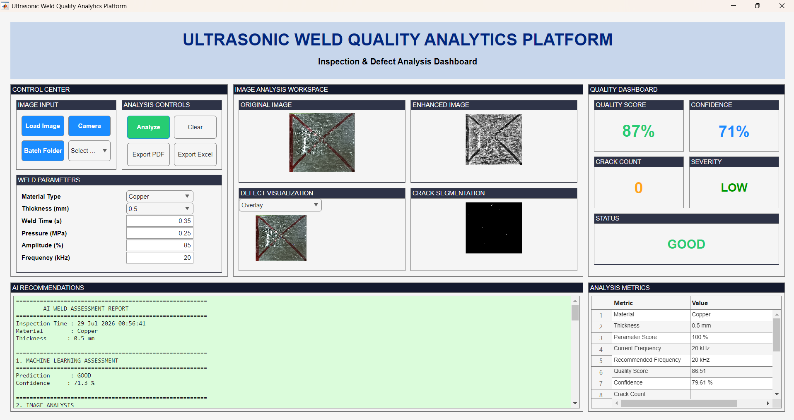

# 🔍 Ultrasonic Weld Quality Analytics Platform Using Machine Learning and Digital Image Processing


A **MATLAB-based intelligent weld inspection system** that integrates **Digital Image Processing** and **Machine Learning** to automate ultrasonic weld quality assessment. The platform employs an **Intelligent Weld Learning Engine (IWLE)** powered by a **Random Forest classifier** to perform weld quality prediction, defect analysis, confidence estimation, and automated inspection report generation.

---

# 📖 Project Overview

Ultrasonic welding is widely used in modern manufacturing because it produces strong, reliable joints without requiring additional filler materials. However, traditional weld inspection methods rely heavily on manual visual inspection or destructive testing, making them time-consuming, subjective, and expensive.

This project introduces an **Ultrasonic Weld Quality Analytics Platform** that combines **Digital Image Processing**, **Machine Learning**, and an **Interactive MATLAB GUI** to automate weld inspection.

The system performs:

- ✅ Image preprocessing
- ✅ Automatic weld region localization
- ✅ Feature extraction
- ✅ Machine learning-based weld classification
- ✅ Defect visualization
- ✅ Confidence estimation
- ✅ Automated inspection report generation

---

# 🚀 Features

- Intelligent Weld Learning Engine (IWLE)
- Digital image preprocessing and enhancement
- Automatic weld localization
- Crack and defect detection
- Multi-feature extraction
- Random Forest-based weld quality prediction
- Confidence score estimation
- Similarity analysis
- Material-specific welding recommendations
- Interactive MATLAB Graphical User Interface (GUI)
- Automated report generation

---

# 🏗️ System Workflow

```text
                    TRAINING PHASE

          Ultrasonic Weld Images
                    │
                    ▼
          Image Preprocessing
                    │
                    ▼
             ROI Detection
                    │
                    ▼
          Feature Extraction
                    │
                    ▼
   Intelligent Weld Learning Engine
                  (IWLE)
                    │
                    ▼
        Random Forest Training
                    │
                    ▼
             Trained Model


                  INSPECTION PHASE

              New Weld Image
                    │
                    ▼
          Image Preprocessing
                    │
                    ▼
          Feature Extraction
                    │
                    ▼
      Random Forest Prediction
                    │
                    ▼
        Weld Quality Assessment
                    │
                    ▼
      Automated Inspection Report
```

---

# 🧠 Machine Learning Pipeline

The Intelligent Weld Learning Engine (IWLE) performs:

- Dataset preparation
- Image preprocessing
- Feature extraction
- Feature normalization
- Dataset balancing
- Hyperparameter optimization
- Random Forest training
- 5-Fold Cross Validation
- Model deployment
- Prediction confidence estimation

---

# 🖼️ Image Processing Pipeline

The platform performs the following operations:

- Grayscale Conversion
- Adaptive Histogram Equalization (CLAHE)
- Noise Reduction
- Automatic Weld Region Localization
- Crack Segmentation
- Defect Visualization
- Statistical Feature Extraction
- Texture Feature Extraction
- Shape Feature Extraction
- Gradient Feature Extraction
- Frequency Domain Feature Extraction

---

# 📊 Dataset

The Intelligent Weld Learning Engine was trained using:

- **128 labelled ultrasonic weld images**
- Multiple weld quality categories
- Supervised learning approach

Each weld image undergoes:

- Image preprocessing
- Weld localization
- Feature extraction
- Feature vector generation

before being incorporated into the training dataset.

---

# 💻 Technologies Used

| Technology | Purpose |
|------------|---------|
| MATLAB | Application Development |
| Digital Image Processing | Weld Image Analysis |
| Machine Learning | Weld Quality Classification |
| Random Forest | Supervised Learning Model |
| MATLAB GUI | User Interface |
| Image Processing Toolbox | Image Enhancement & Feature Extraction |
| Statistics & Machine Learning Toolbox | Model Training |

---

# 📈 Representative Results

| Parameter | Value |
|-----------|-------|
| Material | Copper |
| Thickness | 0.5 mm |
| Quality Score | **86.51%** |
| Machine Learning Prediction | **GOOD** |
| Machine Learning Confidence | **71.3%** |
| Rule-Based Prediction | **GOOD** |
| Overall Confidence | **79.61%** |
| Defect Type | **NO DEFECT** |
| Crack Count | **0** |
| Severity | **LOW** |
| Final Decision | ✅ **GOOD** |

---

# 🖥️ Graphical User Interface

The developed MATLAB GUI provides:

- Original Weld Image
- Enhanced Image
- Defect Visualization
- Crack Segmentation
- Quality Dashboard
- Machine Learning Prediction
- Confidence Estimation
- Material Information
- Process Parameters
- Automated Inspection Report

---

# 🖥️ Main Graphical User Interface

<p align="center">
  
</p>

<p align="center">
<b>Figure 1.</b> Main MATLAB GUI of the Ultrasonic Weld Quality Analytics Platform showing image preprocessing, defect visualization, machine learning prediction, confidence estimation, quality assessment, and automated inspection reporting.
</p>
---

# 🔄 Overall Workflow

<p align="center">
  
</p>

<p align="center">
<b>Figure 2.</b> Overall workflow of the proposed Ultrasonic Weld Quality Analytics Platform.
</p>

# ⚙️ Requirements

- MATLAB R2023a (or newer)
- Image Processing Toolbox
- Statistics and Machine Learning Toolbox

---

# 📄 Project Report

The complete internship report is available in:

```text
docs/Internship_Report.pdf
```

---

# 🔮 Future Improvements

Potential future enhancements include:

- Deep Learning-based defect classification
- CNN and Vision Transformer models
- Real-time industrial deployment
- Live ultrasonic camera integration
- Explainable AI (XAI)
- Cloud-based inspection platform
- Larger training datasets
- Multi-material weld analysis
- Edge AI deployment

---

# 👨‍💻 Author

**Sagar Sant**

**B.Sc. (Honours) Data Science and Artificial Intelligence**

Indian Institute of Technology Guwahati

**Roll Number:** 23035010233

📧 **Email:** sagar.sant@op.iitg.ac.in

---

# 📚 Citation

If you use this project in your research or academic work, please cite:

```text
Sagar Sant,
"Ultrasonic Weld Quality Analytics Platform Using Machine Learning and Digital Image Processing,"
Internship Project Report,
Indian Institute of Technology Guwahati,
2026.
```

---

<div align="center">

### ⭐ If you found this project helpful, please consider giving it a Star!

**Thank you for visiting this repository!**

</div>
